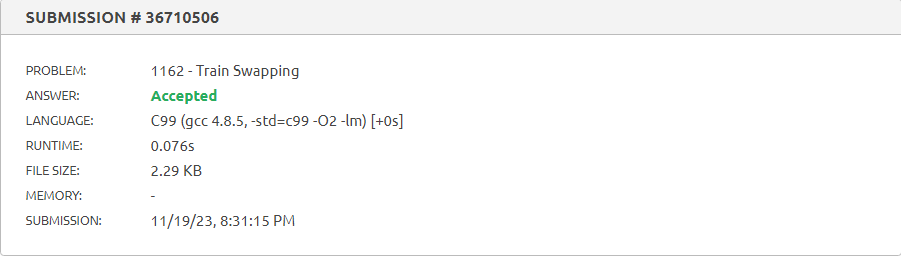

# D-C_QuestoesJuiz

- **Número da dupla**: 29
- **Conteúdo da Disciplina**: Dividir e Conquistar

## Alunos
| Matrícula  | Aluno                   |
| ---------- | ----------------------- |
| 18/0102761 | Jefferson França Santos |
| 20/0049879 |  Yago Milagres Passos   |

## Sobre 
Exercícios do [Beecrowd](https://www.beecrowd.com.br) com nível 5 ou mais.
  
Exercícios escolhidos:

- [Train Swapping - 1162](https://www.beecrowd.com.br/judge/en/problems/view/1162): O exercício envolve a automação de uma operação realizada por "organizadores de vagões" em uma estação de trem. O objetivo é criar um programa que, dado um trem com vagões em uma configuração inicial, determine o número mínimo de trocas necessárias para organizá-los em uma ordem específica. A única operação permitida é girar uma ponte em 180 graus, trocando a posição de dois vagões. A saída deve indicar o número mínimo de trocas para cada caso de teste.

- [Bubbles and Buckets - 1088](https://www.beecrowd.com.br/judge/en/problems/view/1088): 
No jogo "Bolhas e Baldes", Andrea, Carlos e Marcelo jogam em torno de uma sequência aleatória de inteiros. Cada jogador, começando por Marcelo, faz um movimento, que consiste em inverter a posição de dois elementos consecutivos fora de ordem na sequência. O jogo continua até que a sequência esteja ordenada, e o jogador incapaz de fazer um movimento perde. A tarefa é determinar quem ganha o jogo com base na sequência inicial. A entrada contém vários casos de teste, e a saída deve indicar o nome do vencedor para cada caso, sendo Carlos ou Marcelo. O final da entrada é indicado por um caso com N igual a zero.

- [Problema dos pares mais próximos - 1295](https://www.beecrowd.com.br/repository/UOJ_1295.html): O problema dos Pares Mais Próximos envolve encontrar a distância entre os pontos mais próximos em um conjunto bidimensional. A entrada consiste em vários casos de teste, cada um começando com o número de pontos N, seguido pelas coordenadas bidimensionais dos pontos. A saída deve apresentar a distância entre os dois pontos mais próximos, com quatro dígitos após o ponto decimal. Se não houver dois pontos com distância menor que 10000, a saída deve ser "INFINITY". O final da entrada é indicado por um conjunto com N igual a zero.
  
- [Carta de natal criptografada - 3038](https://www.beecrowd.com.br/repository/UOJ_3038.html): O problema envolve descriptografar frases criptografadas por uma criança, onde todas as vogais foram substituídas por símbolos, seguindo uma tabela de tradução. O programa lê frases criptografadas, aplica a tradução e imprime as frases descriptografadas até encontrar o final do arquivo (EOF).
  
## Screenshots

## Especificação
**Linguagem**: C e C++ 

## Uso 

Para rodar os programas, você só precisa fazer o download dos códigos e carregá-los em um [compilador online](https://www.onlinegdb.com/online_c_compiler) ou em um editor de código-fonte e instalar com um compilador C e C++ de sua preferëncia. Também pode-se copiar os códigos dos problemas, presentes nas pastas desse repositório, e colá-los direto em seus respectivos links do [beecrowd](https://www.beecrowd.com.br/)

## Vídeo

O arquivo do vídeo está disponível [aqui](./apresentacao.mp4) e [aqui](./Apresentaçao_PA.mp4) ou no [link do youtube](https://youtu.be/WyOJDrcuZT4).
